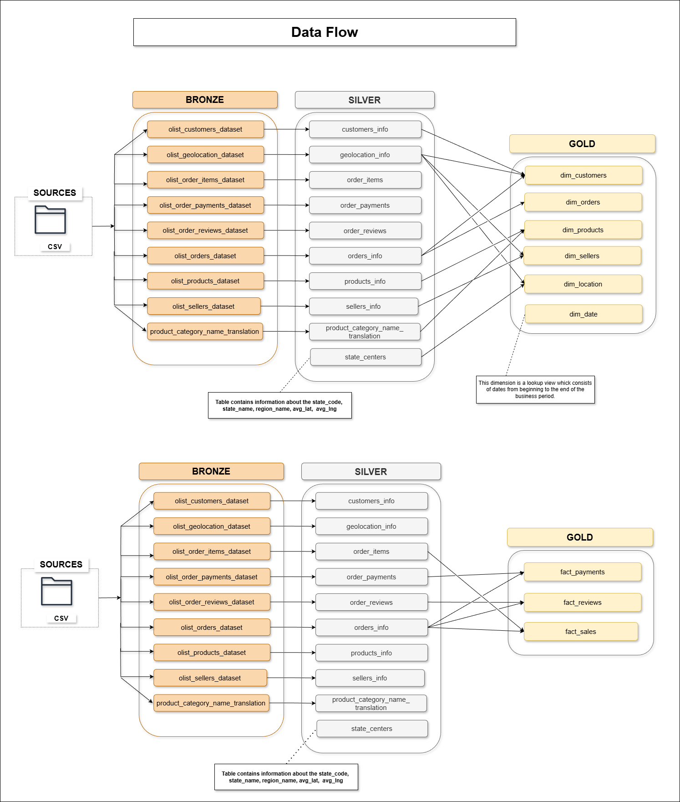
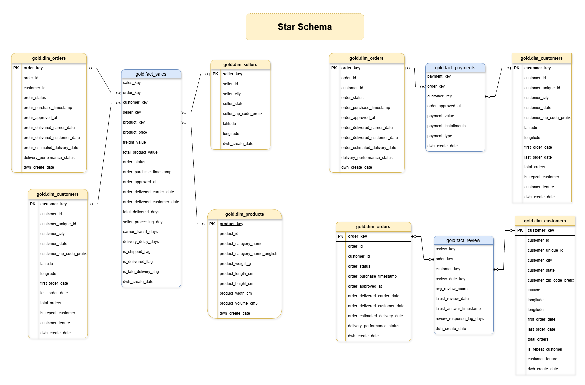
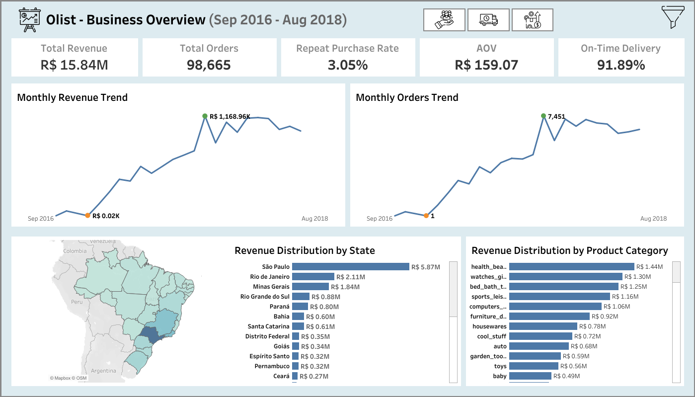

# 🏛️ SQL Data Warehouse: End-to-End E-Commerce Project

Welcome to the **Data Warehouse and Analytics Project** repository.
This project demonstrates a production-style SQL Data Warehouse built using SQL Server and the Medallion Architecture (Bronze → Silver → Gold).

The system ingests raw transactional data, applies structured data cleansing and validation logic, and models the data into a dimensional Star Schema optimized for analytical workloads.
The resulting warehouse provides a trusted analytical foundation that can power downstream BI tools such as Tableau.

----

## 🎯 Project Overview

### 🛠️ Building the Data Warehouse (Data Engineering)
**Objective:** Develop a modern data warehouse using **SQL Server** to consolidate sales data, enabling analytical reporting and informed decision-making.

* **Data Sources:** CSV flat files
* **Data Quality:** Systematic cleansing, validation, and anomaly handling
* **Modeling:** Star Schema optimized for analytical workloads
* **Architecture:** Medallion (Bronze → Silver → Gold)
* **Governance:** Clear separation between raw, refined, and business-ready data
* **Outcome:** A single, trusted source of truth for analytics and dashboards

### 📊 Analytical Use Cases Enabled by the Warehouse
This project answers critical business questions such as:

- Revenue and order trend analysis
- Customer growth and repeat purchase behaviour
- Delivery performance and delay impact on reviews
- Product category performance and seasonality
- Customer lifetime value (LTV) and retention analysis

👉 All metrics are derived from Gold-layer SQL tables and validated through Tableau dashboards, which serve as the single source of truth.

----

## ⚙️ ETL Pipeline Workflow

The data warehouse is populated through a structured SQL-based ETL pipeline that transforms raw transactional datasets into analytics-ready dimensional tables.

### Pipeline Flow

1. **Source Data Extraction**
   - Raw CSV datasets from the Olist marketplace are collected as the source system.
   - The datasets contain transactional data such as orders, customers, products, sellers, and reviews.

2. **Raw Data Ingestion**
   - Data is loaded into the Bronze layer using `BULK INSERT`.
   - Each table mirrors the source schema and acts as the immutable ingestion layer.

3. **Data Transformation & Validation**
   - Silver layer transformations perform data cleansing and standardization.
   - Business logic is applied to validate timestamps, normalize categorical values, and correct inconsistencies.
   - Data quality checks ensure referential consistency before promoting records.

4. **Dimensional Modeling**
   - Cleaned data is modeled into a Star Schema in the Gold layer.
   - Fact tables capture transactional events at the order-item level.
   - Dimension tables provide descriptive business attributes.

5. **Analytics Consumption**
   - Gold-layer tables serve as the trusted source for analytical queries and BI tools.
   - Tableau dashboards validate business metrics and demonstrate analytical use cases.

----

## 🏗️ Data Architecture
This project implements the **Medallion Architecture**, progressing through Bronze, Silver, and Gold layers to ensure data reliability.

**🥉 Bronze Layer – Raw Ingestion**
* CSV source data loaded using BULK INSERT
* Tables mirror the raw source schema
* Designed as immutable ingestion layer
* Batch load with transaction control and validation checks

**🥈 Silver Layer – Data Standardization & Quality**
* Data cleansing and encoding normalization
* NULL handling and anomaly correction
* Temporal validation of order and delivery timestamps
* Business rule enforcement and derived attribute creation

**🥇 Gold Layer – Dimensional Modeling**
* Star Schema designed for analytical workloads
* Surrogate key generation for all dimensions and facts
* Fact tables built at order-item grain
* Referential integrity enforced across dimensions

----

## 📐 Data Warehouse Schema

The Gold layer is modeled using a Star Schema optimized for analytical workloads.

----

# 🛒 Olist E-Commerce Analytics Hub

## 📊 Dataset Overview
* **Source:** [Olist E-Commerce Public Dataset (Kaggle)](https://www.kaggle.com/datasets/olistbr/brazilian-ecommerce)
* **Context:** Real commercial data from **100,000 orders** (2016–2018) in Brazil.
* **Structure:** 9 interconnected tables forming a robust relational schema.

## 🌎 Business Context

Olist is a leading Brazilian e-commerce platform that enables small and medium-sized sellers to reach millions of customers across Brazil. Founded in 2015, Olist acts as a bridge between sellers and major marketplaces, helping them manage sales, logistics, and customer experience.

---

## 📊 Analytics Consumption Layer (Tableau)

The Gold-layer Star Schema is consumed by a suite of interactive Tableau dashboards, offering a 360° view of business performance — from executive KPIs to operational and retention risks.

A Tableau dashboard is used to validate the correctness of business metrics and demonstrate how the warehouse supports downstream BI tools.

🔗 **Tableau Public:** [View Dashboard](https://public.tableau.com/app/profile/hruday.madanu/viz/Olist_Brazil_Dashboard/Olist-BusinessOverviewDashboard)

----

## 💡 Example Business Insights Enabled by the Warehouse

**1. Retention Is the Core Business Risk**
* 96.95% churn and ~1 order per customer indicates that every customer leaves after their first purchase.
* Recommend category-specific loyalty programs for Health & Beauty and Bed Bath Table.

**2. Delivery Delays Directly Destroy Reviews**
* Review scores fall from 4.3 → ~1.6 as delays exceed 14 days.
* Enforce stricter SLAs for high-risk sellers and categories.

**3. Cross-Sell Can Increase AOV Without New Users**
* Frequently bought-together patterns suggest strong bundle pricing opportunities.
* Especially effective in home and lifestyle categories.

**4. Geography-Driven Operations Strategy**
* São Paulo, Rio, and Minas Gerais should receive priority logistics investment.
* High-delay regions need localized fulfillment solutions.

---

## 🛠️ Tech Stack & Tools
The following tools were leveraged to build this end-to-end analytical solution:

* **💾 SQL Server 2022**: Primary Database Engine used for the Data Warehouse (Bronze, Silver, and Gold layers).
* **📊 Tableau**: Data Visualization & Business Intelligence.
* **📐 Draw.io**: Used for designing the **Data Architecture** and **Star Schema** ERD.
* **📓 Notion**: Utilized for project management, technical documentation, and tracking data mapping requirements.

---

## 📌 Data Engineering Skills Demonstrated
* Data Warehouse Architecture (Medallion: Bronze / Silver / Gold)
* Dimensional Modeling (Star Schema)
* ETL / ELT Pipeline Development using SQL Server
* Data Quality Frameworks and Validation Logic
* Advanced SQL (Joins, CTEs, Window Functions)
* Query Optimization and Indexing
* Analytical Data Modeling for BI consumption

---

## 📂 Repository Structure
* `📁 assets`: Screenshots of charts and dashboards used in this project.
* `📁 datasets`: Placeholder for raw CSV data.
* `📁 documents`: Project documentation such as **Data Catalog**.
* `📁 scripts`:
    * `📁 bronze`: DDLs and Bulk Load scripts for raw ingestion.
    * `📁 silver`: DDLs and stored procedures for data refinement.
    * `📁 gold`: DDLs for business-ready Star Schema tables with indexing.
* `📁 tests`: Dedicated SQL scripts for **Quality Checks** on the Silver and Gold layers.

---

## 👨‍💻 About Me
**Hruday Bhaskar Madanu** - *Data Engineer | Former Operations Professional*

I am an Aspiring Data Engineer focused on building scalable, production-grade data platforms using SQL, Databricks, Azure. My expertise lies in designing Medallion architectures, optimizing performance, and implementing robust orchestration patterns.

* **LinkedIn:** [linkedin.com/in/hruday-bhaskar-madanu](https://www.linkedin.com/in/hruday-bhaskar-madanu)

---

## ⚖️ License
This project is licensed under the **MIT License**.
