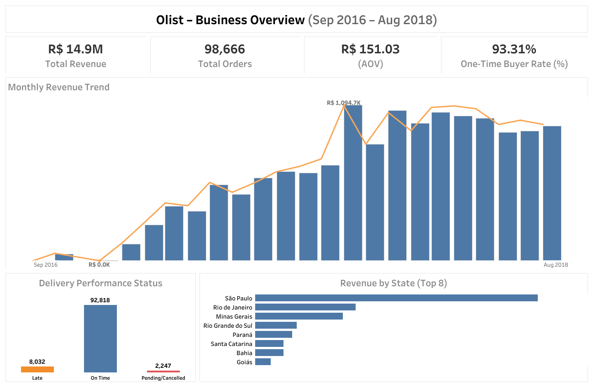

# 📊 Olist – Business Overview Dashboard

This dashboard provides a high-level view of Olist’s business performance,
including revenue, orders, customer repeat rate, and delivery health.

---

### 🚀 KPIs
- Total Revenue
- Total Orders
- Average Order Value (AOV)
- Repeat Customer Rate

---

### 🖥️ Dashboard (Tableau)
🔗 Tableau Public: <https://public.tableau.com/app/profile/hruday.madanu/viz/Olist-BusinessOverview/Dashboard1>

---

### 💡 Key Insights
- Revenue shows strong seasonality with peaks in Q4.
- A small group of states contributes the majority of revenue.
- Late deliveries remain a measurable operational issue.
