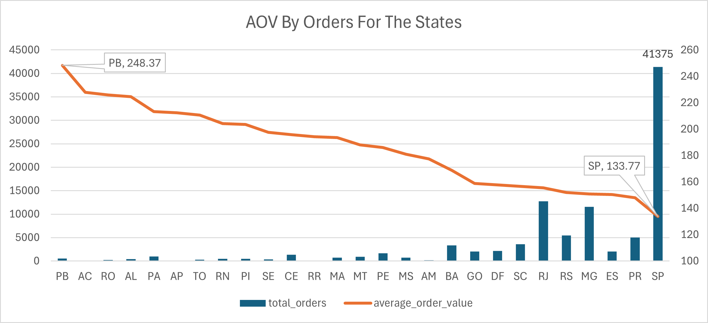
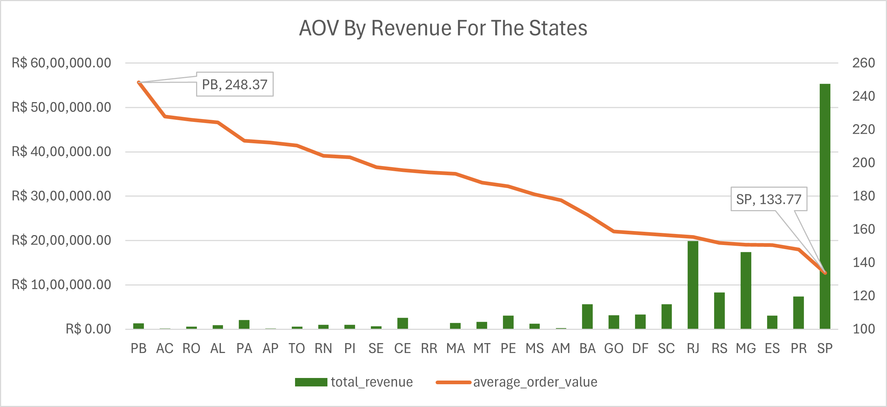

# 📉 High Order Volume but Low Revenue by Customer State

---

## 🧠 Business Question
Which customer states generate **high order volumes** but **low average revenue per order**, indicating potential pricing, product-mix, or discounting issues?

---

## 🎯 Why This Matters
- Highlights regions with **strong demand but weak monetization**
- Identifies opportunities to:
  - Improve pricing strategies
  - Upsell higher-value products
  - Optimize promotional effectiveness
- Supports regional profitability analysis beyond raw order counts

---

## 🧩 Data Sources
| Layer | View |
|------|------|
| Gold | `gold.fact_sales` |
| Gold | `gold.dim_customers` |

---

## 🛠️ Business Logic
For each customer state:
- Count distinct orders
- Sum total product revenue
- Calculate **State Average Order Value (AOV)**

Filters applied:
- States with **more than 2,000 orders**
- States with **AOV below 170**

Results are ordered by **highest order volume**.

---

## 📌 Key Metrics

<details>
<summary><strong>Click to view full AOV distribution</strong></summary>
  
| State | Total Orders | Total Revenue | State AOV |
|------|-------------:|--------------:|----------:|
| SP | 41,375 | 5,534,919.01 | **133.77** |
| RJ | 12,762 | 1,985,032.34 | **155.54** |
| MG | 11,544 | 1,740,465.48 | **150.77** |
| RS | 5,432 | 825,079.13 | **151.89** |
| PR | 4,998 | 739,428.92 | **147.94** |
| SC | 3,612 | 565,692.13 | **156.61** |
| BA | 3,358 | 566,543.39 | **168.71** |
| DF | 2,125 | 334,941.87 | **157.62** |
| ES | 2,025 | 304,734.98 | **150.49** |
| GO | 2,007 | 318,632.69 | **158.76** |
| PE | 1,648 | 306,566.65 | **186.02** |
| CE | 1,327 | 259,661.52 | **195.68** |
| PA | 970 | 206,946.70 | **213.34** |
| MT | 903 | 169,811.31 | **188.05** |
| MA | 740 | 143,209.56 | **193.52** |
| MS | 709 | 128,365.68 | **181.05** |
| PB | 532 | 132,132.78 | **248.37** |
| PI | 493 | 100,309.32 | **203.47** |
| RN | 482 | 98,467.47	| **204.29** |
| AL | 411 | 92,257.08	| **224.47** |
| SE | 345 | 68,128.82	| **197.47** |
| TO | 279 | 58,743.56	| **210.55** |
| RO | 247 | 55,810.19	| **225.95** |
| AM | 147 | 26,091.38	| **177.49** |
| AC | 81 | 18,467.42 | **227.99** |
| AP | 68	| 14,435.46 | **212.28** |
| RR | 46	| 8,933.94	| **194.21** |

</details>

---

## 📊 Visualization




---

## 🔍 Key Insights
- **Paraíba (PB)** leads with the highest AOV despite moderate order volume
- **São Paulo (SP)** dominates order volume but has the **lowest AOV**, pulling down overall revenue efficiency
- Large markets (RJ, MG) show similar patterns: high demand, moderate spend per order
- States with **lower order counts** (PR, AP) still show strong purchasing power
- High AOV does not always correlate with high order volume
- Indicates opportunity to:
  - Increase customer acquisition in high-AOV regions
  - Customize promotions for lower-volume, high-value states

---

## 📊 Business Use Cases
- Regional pricing and discount optimization
- Bundling and cross-sell strategies
- Product mix rebalancing
- Revenue uplift modeling in high-traffic regions

---

## 🧱 SQL Reference

```sql
SELECT 
    c.customer_state,
    COUNT(DISTINCT f.order_key) AS total_orders,
    SUM(f.total_product_value) AS total_revenue,
    SUM(f.total_product_value) / COUNT(DISTINCT f.order_key) AS state_aov
FROM gold.fact_sales f
LEFT JOIN gold.dim_customers c ON f.customer_key = c.customer_key
GROUP BY c.customer_state
ORDER BY total_orders DESC;
