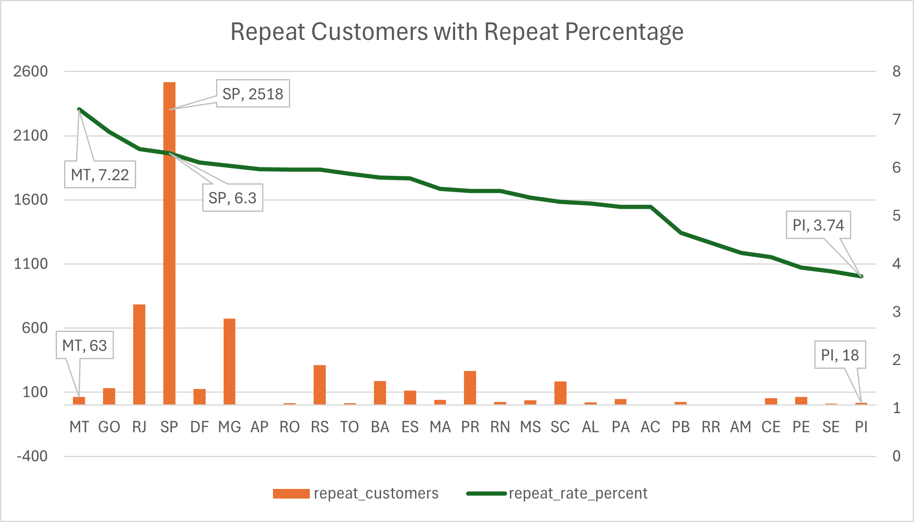
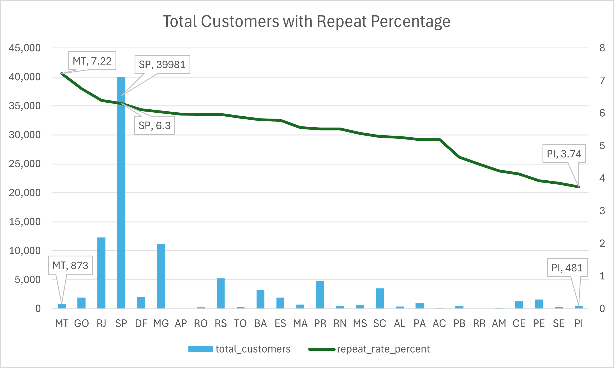

# 🔁 Repeat Purchase Rate by Customer State

---

## 🧠 Business Question
Which **customer states have the highest repeat purchase rate**, indicating stronger customer loyalty and retention?

---

## 🎯 Why This Matters
- Identifies **high-retention regions**
- Helps target:
  - Regional marketing campaigns
  - Loyalty programs
  - Expansion strategies
- Supports resource allocation to states with better **long-term customer value**

---

## 🧩 Data Sources
| Layer | View |
|------|------|
| Gold | `gold.fact_sales` |
| Gold | `gold.dim_customers` |

---

## 🛠️ Business Logic
- Aggregate orders at the **customer_unique_id + state** level
- Classify customers as:
  - **Repeat customers** → more than 1 order
  - **One-time customers** → exactly 1 order
- Calculate:
  - Total customers per state
  - Repeat customers per state
  - Repeat purchase rate (%)
- Filter states with **more than 500 customers** for statistical reliability

---

## 📌 Key Metrics

<details>
<summary><strong>Click to view state-level repeat purchase rates</strong></summary>

| State | Total Customers | Repeat Customers | Repeat Rate (%) |
|------|----------------:|-----------------:|----------------:|
| MT | 873 | 63 | 7.22 |
| GO | 1,942 | 131 | 6.75 |
| RJ | 12,303 | 786 | 6.39 |
| SP | 39,981 | 2,518 | 6.30 |
| DF | 2,062 | 126 | 6.11 |
| MG | 11,178 | 675 | 6.04 |
| AP | 67 | 4 | 5.97 |
| RO | 235 | 14 | 5.96 |
| RS | 5,249 | 313 | 5.96 |
| TO | 272 | 16 | 5.88 |
| BA | 3,257 | 189 | 5.80 |
| ES | 1,956 | 113 | 5.78 |
| MA | 719 | 40 | 5.56 |
| PR | 4,840 | 267 | 5.52 |
| RN | 471 | 26 | 5.52 |
| MS | 688 | 37 | 5.38 |
| SC | 3,513 | 186 | 5.29 |
| AL | 399 | 21 | 5.26 |
| PA | 944 | 49 | 5.19 |
| AC | 77 | 4 | 5.19 |
| PB | 516 | 24 | 4.65 |
| RR | 45 | 2 | 4.44 |
| AM | 142 | 6 | 4.23 |
| CE | 1,305 | 54 | 4.14 |
| PE | 1,605 | 63 | 3.93 |
| SE | 338 | 13 | 3.85 |
| PI | 481 | 18 | 3.74 |

</details>

---

## 🖼️ Visualization




---

## 🔍 Key Insights
- **MT, GO, and RJ** show the strongest repeat purchase behavior
- Large markets like **SP and RJ** combine:
  - High customer volume
  - Above-average repeat rates
- Northern and northeastern states generally show **lower retention**

---

## 📊 Business Implications
- States with higher repeat rates can be:
  - Used as **benchmark regions**
  - Targeted for premium offerings
- Low-repeat states may require:
  - Better delivery performance
  - Localized promotions
  - Improved post-purchase engagement

---

## 🧱 SQL Reference

```sql
WITH CustomerStats AS (
    SELECT 
        c.customer_state,
        c.customer_unique_id,
        COUNT(f.order_key) AS total_orders
    FROM gold.fact_sales f
    LEFT JOIN gold.dim_customers c ON f.customer_key = c.customer_key
    GROUP BY c.customer_state, c.customer_unique_id
)
SELECT 
    customer_state,
    COUNT(customer_unique_id) AS total_customers,
    SUM(CASE WHEN total_orders > 1 THEN 1 ELSE 0 END) AS repeat_customers,
    CAST(100.0 * SUM(CASE WHEN total_orders > 1 THEN 1 ELSE 0 END) / COUNT(customer_unique_id) AS DECIMAL(5,2)) AS repeat_rate_percent
FROM CustomerStats
GROUP BY customer_state
ORDER BY repeat_rate_percent DESC;
