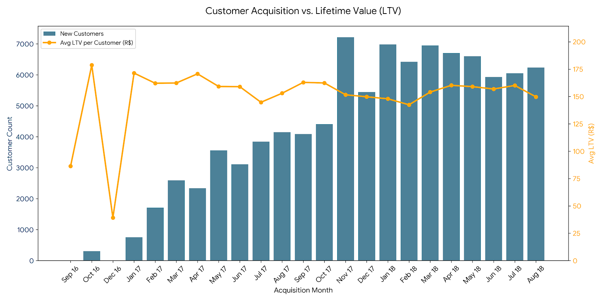

# 💰 Customer Lifetime Value (LTV) by Acquisition Month

---

## 🧠 Business Question
What is the **average customer lifetime value (LTV)** based on the **month a customer was first acquired**?

This analysis helps understand:
- Which acquisition cohorts generate higher long-term value
- How customer quality changes over time
- Whether recent cohorts are more or less valuable than early ones

---

## 🎯 Why This Matters
- Guides **marketing spend allocation**
- Helps evaluate **cohort quality**, not just volume
- Supports **long-term revenue forecasting**
- Useful for identifying seasonality or acquisition strategy shifts

---

## 🧩 Data Sources
| Layer | View |
|------|------|
| Gold | `gold.dim_orders` |
| Gold | `gold.dim_customers` |
| Gold | `gold.fact_sales` |
| Gold (Temp Table) | `gold.bridge_customer_orders` |

---

## 🛠️ Business Logic
1. Build a **bridge table** mapping customers to all their orders
2. Identify each customer’s **acquisition month** (first purchase)
3. Calculate **lifetime revenue per customer**
4. Aggregate by acquisition month to compute:
   - Total customers acquired
   - Total cohort LTV
   - **Average LTV per customer**

---

## 📌 Key Metrics

<details>
<summary><strong>Click to view LTV by Acquisition Month results</strong></summary>

| Acquisition Month | Customers | Total LTV | Avg LTV per Customer |
|------------------|----------:|----------:|---------------------:|
| 201609 | 3 | 259.11 | 86.37 |
| 201610 | 305 | 54,499.15 | 178.69 |
| 201612 | 1 | 39.24 | 39.24 |
| 201701 | 754 | 129,260.87 | 171.43 |
| 201702 | 1,708 | 276,915.80 | 162.13 |
| 201703 | 2,595 | 421,341.40 | 162.37 |
| 201704 | 2,340 | 399,562.87 | 170.75 |
| 201705 | 3,563 | 567,197.25 | 159.19 |
| 201706 | 3,113 | 494,981.12 | 159.00 |
| 201707 | 3,844 | 556,378.88 | 144.74 |
| 201708 | 4,150 | 635,008.66 | 153.01 |
| 201709 | 4,089 | 666,169.62 | 162.92 |
| 201710 | 4,410 | 716,242.92 | 162.41 |
| 201711 | 7,216 | 1,093,932.65 | 151.60 |
| 201712 | 5,446 | 815,659.27 | 149.77 |
| 201801 | 6,981 | 1,032,549.16 | 147.91 |
| 201802 | 6,421 | 914,812.34 | 142.47 |
| 201803 | 6,948 | 1,070,353.74 | 154.05 |
| 201804 | 6,707 | 1,074,838.77 | 160.26 |
| 201805 | 6,603 | 1,050,100.38 | 159.03 |
| 201806 | 5,934 | 930,871.19 | 156.87 |
| 201807 | 6,052 | 969,102.66 | 160.13 |
| 201808 | 6,237 | 933,731.73 | 149.71 |

</details>

---

## 🖼️ Visualization




## 🔍 Key Insights
- **Early cohorts (2016–2017)** generally show **higher average LTV**
- Peak average LTV observed in:
  - **Oct 2016 (~178.7)**
  - **Apr 2017 (~170.8)**
- **Customer volume increases significantly after mid-2017**, but:
  - Average LTV slightly declines
- Indicates a **trade-off between scale and customer value**

---

## 📊 Business Interpretation
- Growth phases brought more customers, but at **lower average value**
- Possible drivers:
  - Increased promotions
  - Expansion into lower-ticket categories
  - Broader geographic reach
- Acquisition strategies should balance:
  - **Customer volume**
  - **Customer quality (LTV)**

---

## 🧱 SQL Reference

```sql

-- Removing the bridge table if it already exists from a previous run to avoid errors.
DROP TABLE IF EXISTS gold.bridge_customer_orders;

-- Creating a temporary bridge table 
SELECT
    dc.customer_unique_id,
    do.order_key,
    (YEAR(do.order_purchase_timestamp) * 100 
     + MONTH(do.order_purchase_timestamp)) AS order_year_month
INTO gold.bridge_customer_orders
FROM gold.dim_orders do
JOIN gold.dim_customers dc
    ON do.customer_id = dc.customer_id;

-- index to optimize the performance of the subsequent CTE joins
CREATE CLUSTERED INDEX CX_bridge_customer_orders
ON gold.bridge_customer_orders (customer_unique_id, order_year_month);

-- Identifying the acquisition month and sum total spend per customer
WITH CustomerAcquisition AS (
    -- first month each unique customer made a purchase
    SELECT
        customer_unique_id,
        MIN(order_year_month) AS acquisition_month
    FROM gold.bridge_customer_orders
    GROUP BY customer_unique_id
),
  CustomerRevenue AS (
        -- the total lifetime revenue for each unique customer
    SELECT
        b.customer_unique_id,
        SUM(fs.total_product_value) AS lifetime_revenue
    FROM gold.bridge_customer_orders b
    JOIN gold.fact_sales fs
        ON b.order_key = fs.order_key
    GROUP BY b.customer_unique_id
)
-- Aggregating to find Average LTV per Acquisition Cohort
SELECT
    ca.acquisition_month,
    COUNT(*) AS customers,
    SUM(cr.lifetime_revenue) AS total_ltv,
    -- LTV = Total Revenue / Total Unique Customers in that month
    CAST(AVG(cr.lifetime_revenue) AS DECIMAL(10,2)) AS avg_ltv_per_customer
FROM CustomerAcquisition ca
JOIN CustomerRevenue cr
    ON ca.customer_unique_id = cr.customer_unique_id
GROUP BY ca.acquisition_month
ORDER BY ca.acquisition_month;

-- CLEANUP: Removing the temporary bridge table
DROP TABLE gold.bridge_customer_orders
