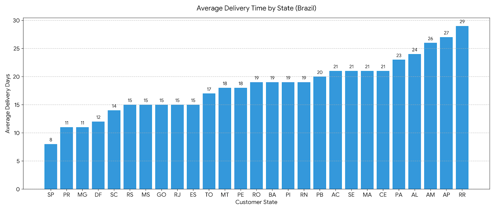

# 🚚 Average Delivery Time by Customer State

---

## 🧠 Business Question
What is the **average delivery time (in days)** for customer orders across different states?

This helps evaluate:
- Regional logistics efficiency
- Delivery performance disparities across states
- Potential bottlenecks in fulfillment and transportation

---

## 🎯 Why This Matters
- Directly impacts **customer satisfaction and reviews**
- Helps identify states requiring **logistics optimization**
- Supports decisions on:
  - Warehouse placement
  - Carrier partnerships
  - Delivery SLA improvements

---

## 🧩 Data Sources
| Layer | View |
|------|------|
| Gold | `gold.dim_orders` |
| Gold | `gold.dim_customers` |

---

## 🛠️ Business Logic
- Consider only orders with status **DELIVERED**
- Exclude records with missing delivery dates
- Calculate delivery time as:
  
  **Delivery Date − Purchase Date**
- Aggregate results by **customer state**
- Sort states by fastest average delivery

---

## 📌 Key Metrics

<details>
<summary><strong>Click to view state-level delivery performance</strong></summary>

| State | Avg Delivery Days |
|------:|------------------:|
| SP | 8 |
| PR | 11 |
| MG | 11 |
| DF | 12 |
| SC | 14 |
| RS | 15 |
| MS | 15 |
| GO | 15 |
| RJ | 15 |
| ES | 15 |
| TO | 17 |
| MT | 18 |
| PE | 18 |
| RO | 19 |
| PI | 19 |
| RN | 19 |
| BA | 19 |
| PB | 20 |
| AC | 21 |
| SE | 21 |
| MA | 21 |
| CE | 21 |
| PA | 23 |
| AL | 24 |
| AM | 26 |
| AP | 27 |
| RR | 29 |

</details>

---

## 🖼️ Visualization



---

## 🔍 Key Insights
- **São Paulo (SP)** has the fastest delivery time at **8 days**
- Southern and Southeastern states generally perform better
- Northern states (AM, AP, RR) show significantly longer delivery times
- Delivery time variance between fastest and slowest states is **21 days**

---

## 📊 Business Interpretation
- Faster deliveries in SP, PR, MG likely due to:
  - Higher seller concentration
  - Better infrastructure
  - Shorter average shipping distances
- Slower delivery in northern regions may be driven by:
  - Geographic distance
  - Limited logistics networks
  - Higher dependency on long-haul transport

---

## 🧱 SQL Reference

```sql
SELECT 
    c.customer_state,
    AVG(DATEDIFF(day, o.order_purchase_timestamp, o.order_delivered_customer_date)) AS avg_delivery_days
FROM gold.dim_orders o
LEFT JOIN gold.dim_customers c 
    ON o.customer_id = c.customer_id
WHERE o.order_status = 'DELIVERED'
  AND o.order_delivered_customer_date IS NOT NULL
GROUP BY c.customer_state
ORDER BY avg_delivery_days ASC;
