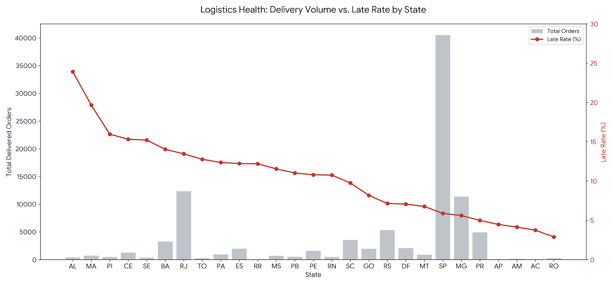

# ⏱️ States with the Highest Late Delivery Rate

---

## 🧠 Business Question
Which customer states experience the **highest percentage of late deliveries** compared to the estimated delivery date?

Late deliveries directly affect:
- Customer satisfaction
- Review scores
- Repeat purchase behavior

---

## 🎯 Why This Matters
- Identifies regions with **logistics reliability issues**
- Helps prioritize **carrier optimization** and **delivery SLA reviews**
- Supports proactive interventions in high-risk states

---

## 🧩 Data Sources
| Layer | View |
|------|------|
| Gold | `gold.dim_orders` |
| Gold | `gold.dim_customers` |

---

## 🛠️ Business Logic
- Consider only orders with status **DELIVERED**
- A delivery is marked **late** if:

  `actual_delivery_date > estimated_delivery_date`

- Aggregate metrics by **customer state**
- Calculate:
  - Total delivered orders
  - Late orders
  - Late delivery rate (%)
- Rank states by **highest late delivery rate**

---

## 📌 Key Metrics

<details>
<summary><strong>Click to view state-level late delivery performance</strong></summary>

| State | Delivered Orders | Late Orders | Late Rate (%) |
|------:|-----------------:|------------:|--------------:|
| AL | 397 | 95 | 23.93 |
| MA | 717 | 141 | 19.67 |
| PI | 476 | 76 | 15.97 |
| CE | 1,279 | 196 | 15.32 |
| SE | 335 | 51 | 15.22 |
| BA | 3,256 | 457 | 14.04 |
| RJ | 12,350 | 1,664 | 13.47 |
| TO | 274 | 35 | 12.77 |
| PA | 946 | 117 | 12.37 |
| ES | 1,995 | 244 | 12.23 |
| RR | 41 | 5 | 12.20 |
| MS | 701 | 81 | 11.55 |
| PB | 517 | 57 | 11.03 |
| PE | 1,593 | 172 | 10.80 |
| RN | 474 | 51 | 10.76 |
| SC | 3,546 | 346 | 9.76 |
| GO | 1,957 | 160 | 8.18 |
| RS | 5,345 | 382 | 7.15 |
| DF | 2,080 | 147 | 7.07 |
| MT | 886 | 60 | 6.77 |
| SP | 40,501 | 2,387 | 5.89 |
| MG | 11,354 | 637 | 5.61 |
| PR | 4,923 | 246 | 5.00 |
| AP | 67 | 3 | 4.48 |
| AM | 145 | 6 | 4.14 |
| AC | 80 | 3 | 3.75 |
| RO | 243 | 7 | 2.88 |

</details>

---

## 🖼️ Visualization



---

## 🔍 Key Insights
- **Alagoas (AL)** shows the highest late delivery rate at **23.93%**
- Northeastern states dominate the top of the list
- High-volume states like **SP, MG, PR** maintain relatively low late rates
- Smaller states may show volatility due to lower order volume

---

## 📊 Business Interpretation
- High late delivery rates may be driven by:
  - Limited logistics infrastructure
  - Longer transit distances
  - Inaccurate delivery estimates
- Strong performance in SP and PR suggests:
  - Efficient seller concentration
  - Mature logistics networks

---

## 🧱 SQL Reference

```sql
SELECT 
    c.customer_state,
    COUNT(*) AS total_delivered_orders,
    SUM(CASE 
            WHEN o.order_delivered_customer_date > o.order_estimated_delivery_date 
            THEN 1 ELSE 0 
        END) AS late_orders,
    CAST(100.0 * SUM(CASE 
                        WHEN o.order_delivered_customer_date > o.order_estimated_delivery_date 
                        THEN 1 ELSE 0 
                    END) / COUNT(*) 
        AS DECIMAL(5,2)
    ) AS late_rate_percent
FROM gold.dim_orders o
JOIN gold.dim_customers c 
    ON o.customer_id = c.customer_id
WHERE o.order_status = 'DELIVERED'
GROUP BY c.customer_state
ORDER BY late_rate_percent DESC;
